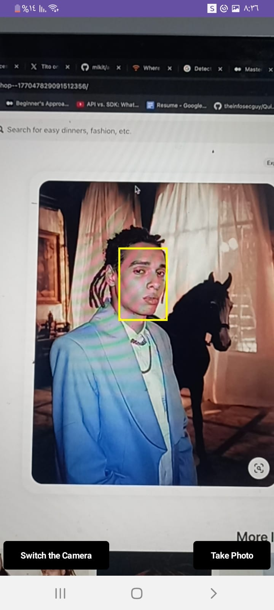
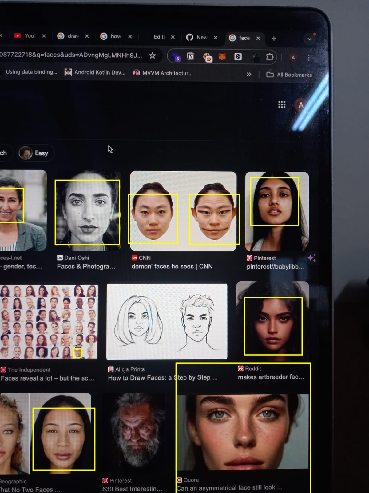

<h1 align="center">Face Detetion with CameraX and Compose using ML kit</h1>


## Overview

- Integrating CameraX with face detection functionality using ML Kit.
- The App Was built with Jetpack Compose

## Tech Stacks

- Jetpack Compose: Leveraged for creating a modern and responsive UI with streamlined and efficient code.

- Hilt: Used for dependency injection to manage and provide dependencies in a scalable and maintainable way.
  
- ML Kit: Employed for advanced face detection capabilities, integrating machine learning seamlessly into the application.

## Camera X 
The CameraContent function is a composable function for Jetpack Compose that provides an interface for capturing images using the device's camera, switching between front and back cameras, and detecting faces in the camera feed.
This function leverages CameraX for camera functionality and face detection, integrating seamlessly with Jetpack Compose for UI rendering.

``` kotlin
  @Composable
fun CameraContent(
  modifier: Modifier = Modifier,
  selectedCamera: CameraSelector,
  imageCapture: ImageCapture,
  onSwitchClick: () -> Unit,
  onTakePhotoClick: () -> Unit,
  context: Context
)
```

1. selectedCamera: A CameraSelector object for selecting the current camera (e.g., front or back).

2. imageCapture: An ImageCapture object for handling image capture functionality.

3. onSwitchClick: A callback function is triggered when the user clicks the button to switch the camera.

4. onTakePhotoClick: A callback function is triggered when the user clicks the button to take a photo.

5. context: The context from the calling component, used for accessing resources and creating views.

At the end of that composable, we  bind the camera with Android View as CameraX is not yet supported in Jetpack Compose.

## Image Analyzer 

The Image Analyzer Class Utilize the ML KIT enabling Face detection with all faces detected and used ML kit with Face Detection Options

So Now let's Understand the options  I choose with myFace Detector 

```kotlin
  private val options = FaceDetectorOptions.Builder()
    .setPerformanceMode(FaceDetectorOptions.PERFORMANCE_MODE_ACCURATE)
    .setClassificationMode(FaceDetectorOptions.CLASSIFICATION_MODE_NONE)
    .setLandmarkMode(FaceDetectorOptions.LANDMARK_MODE_ALL)
    .setContourMode(FaceDetectorOptions.CONTOUR_MODE_ALL)
    .enableTracking()
    .build()

  private val faceDetector = FaceDetection.getClient(options)
```
1. setPerformanceMode(PERFORMANCE_MODE_ACCURATE): We simply prioritize accuracy over speed.

2. setClassificationMode(FaceDetectorOptions.CLASSIFICATION_MODE_NONE) : Disables classification features.

3. setLandmarkMode(FaceDetectorOptions.LANDMARK_MODE_ALL): Landmarks refer to specific points on the face such as the eyes, nose, and mouth. Enabling this mode will detect and return the positions of these landmarks for each face.

4. setContourMode(FaceDetectorOptions.CONTOUR_MODE_ALL): Enables detecting all facial contours.

5. enableTracking(): enables face tracking.


## Ui Screens

I simply built one screen for the app.

|                   Main Screen                        |                   Camera Preview                   |                     
|:----------------------------------------------------:|:--------------------------------------------------:|
|           |                   | 

|                   Example                            |                    
|:----------------------------------------------------:|
|                   |  


